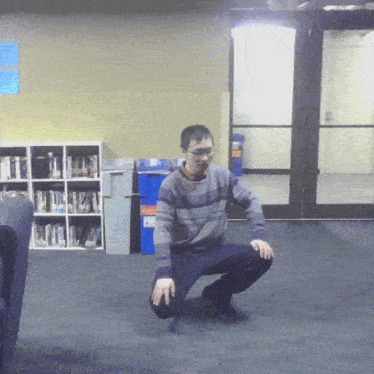
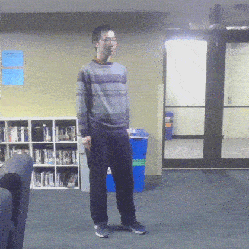

# Human Pose Estimation and Action Recognition
#### Deep Learning Project, Winter 2019, Northwestern University
#### Group members: Chenge Yang, Zhicheng Yu, Feiyu Chen
-----------------------------------------------------------------------------------------
## Results
### Human Pose Estimation Benchmarking
#### 1. Multi-Person (left: AlphaPose, right: OpenPose)
<p align = "center">
  
  
</p>

#### 2. Single-Person (left: AlphaPose, right: OpenPose)
<p align = "center">
  
  
</p>

### Action Recognition
<p align = "center">
  
</p>

-----------------------------------------------------------------------------------------
## Introduction
This project contain two main parts:
### 1. Human Pose Estimation Benchmarking


### 2. Online Skeleton-Based Action Recognition
Real-time multi-person human action recognition based on [tf-pose-estimation](https://github.com/ildoonet/tf-pose-estimation). The pipeline is as follows:
* Real-time multi-person pose estimation via tf-pose-estimation
* Data preprocessing
* Multi-person action recognition with DNN using TensorFlow / Keras

-----------------------------------------------------------------------------------------
## Dependencies and Installation
#### Human Pose Estimation Benchmarking
Check the []().

#### Online Skeleton-Based Action Recognition
Check the [installation_action_recognition.md](doc/installation_action_recognition.md).

-----------------------------------------------------------------------------------------
## Usage
### Human Pose Estimation Benchmarking

### Training Action Recognition Model
* Copy your dataset (must be .csv file) into [/data](data/) folder
* Run [training.py](src/training.py) with the following command:
```
python3 src/training.py --dataset [dataset_filename]
```
* The model is saved in [/model](model/) folder

### Real-time Action Recognition
* To see our multi-person action recognition result using your webcam, run [run_detector.py](src/run_detector.py) with the following command:
```
python3 src/run_detector.py --images_source webcam
```

-----------------------------------------------------------------------------------------
## Implementation (Action Recognition)
### Collecting training data
we collected 3916 training images from our laptop's webcam for training the model and classifying five actions: squat, stand, punch, kick, and wave. In each training image, there is only one person doing one of these 5 actions. The videos are recorded at 10 fps with a frame size of 640 x 480, and then saved to images.

The examples and the numbers of training images for each action class are shown below:  

|squat |stand |punch |kick |wave |
|:---:|:---:|:---:|:---:|:---:|
||  |  |  |  |

|Class label| squat |stand |punch |kick |wave | Total |
|:---:|:---:|:---:|:---:|:---:|:---:|:---:|
|Number of training images|  711|  907|  583|  784|  931| 3916|

### Get Skeleton from Image
We used [tf-pose-estimation](https://github.com/ildoonet/tf-pose-estimation) to detect the human pose in each training image.

The output skeleton format of OpenPose can be found at [OpenPose Demo - Output](https://github.com/CMU-Perceptual-Computing-Lab/openpose/blob/master/doc/output.md).

### Data preprocessing
To transfer the original skeleton data into the input of our neural network, three preprocessing methods are used, which are implemented in [data_preprocessing.py](src/mylib/data_preprocessing.py) :
1. Head reference: all joint positions are converted to the x-y coordinates relative to the head joint.
2. Pose to angle: the 18 joint positions are converted to 8 joint angles: left / right shoulder, left / right elbow, left / right hip, left / right knee.
3. Normalization: all joint positions are converted to the x-y coordinates relative to the skeleton bounding box.

The third approach is used, which gives the best result and robustness.

### DNN model
We built our DNN model refering to [Online-Realtime-Action-Recognition-based-on-OpenPose](https://github.com/LZQthePlane/Online-Realtime-Action-Recognition-based-on-OpenPose). The DNN model is implemented in [training.py](src/training.py) using Keras and Tensorflow. The model consists of an input layer, an output layer and three hidden layers. The output layer uses softmax to conduct a 5-class classification.

-----------------------------------------------------------------------------------------
## Acknowledgement
* [OpenPose](https://github.com/CMU-Perceptual-Computing-Lab/openpose)
* [AlphaPose](https://github.com/MVIG-SJTU/AlphaPose)
* [tf-pose-estimation](https://github.com/ildoonet/tf-pose-estimation)
* [Online-Realtime-Action-Recognition-based-on-OpenPose](https://github.com/LZQthePlane/Online-Realtime-Action-Recognition-based-on-OpenPose)
