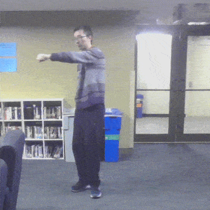
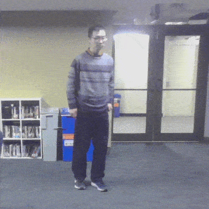
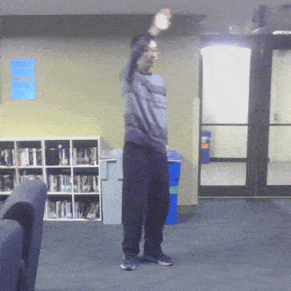

# Collecting Training Data

## Images of Human Action 
we collected 3916 training images from our laptop's camera for training the model and classifying the 5 actions (squat, stand, punch, kick, and wave). In each training image, there is only one person doing one of these 5 actions, as shown in the videos below:  

|squat |stand |punch |kick |wave |
|:---:|:---:|:---:|:---:|:---:|:---:|:---:|:---:|
||  |  |  |  |

The videos were recorded at 10 fps with a framesize of 480x640, and then saved to images.

Number of training images of each action:
|Label | squat |stand |punch |kick |wave | Total
|:---:|:---:|:---:|:---:|:---:|:---:|:---:|:---:|:---:|
|Number|  711|  907|  583|  784|  931| 3916|

## Get Skeleton from Image

We used the OpenPose from [this Github repo](https://github.com/ildoonet/tf-pose-estimation) to detect the human skeleton in each image. We listed the steps for installing its dependency in [notes_Installation_tf-pose-estimation.md](notes_Installation_tf-pose-estimation.md)

The output from each image is the skeleton of **36 values** corresponding to 18 joint positions (xi, yi), where i = 0, 1, ..., 17. The [image](https://github.com/CMU-Perceptual-Computing-Lab/openpose/blob/master/doc/output.md) below shows the order of the 18 joints:  

Figure. Order and indexing of each joint in the skeleton data.

 The x & y values of each joint are represented in the normalized image coordinate, which is defined as follows: the left up corner is (0, 0) and the bottom right corner is (1, 1), with x axis pointing to the right and y axis pointing downwards. If a huamn joint is not detected by OpenPose, we set its position as (0, 0).

## How to run

Run the following command to detect skeleton from each training image:

> $ python3 src/run_detector.py --images_source folder

The input to this [run_detector.py](src/run_detector.py) script are:  
(1) [data/source_images2/valid_images.txt](data/source_images2/valid_images.txt): This file describes the filenames of the valid images and their labels.  
(2) [data/source_images2/](data/source_images2/): All source images.

The output of the script for each image is a 37-element array of [18*(x,y) + label]. They are saved to [src/skeleton_data/skeletons2/](src/skeleton_data/skeletons2/) as txt files.

Then, please run:  
> $ python3 src/skeletons_info_generator.py  

This reads all skeleton data from [src/skeleton_data/skeletons2/](src/skeleton_data/skeletons2/) and generated a single file [src/skeleton_data/skeletons2_info.csv](src/skeleton_data/skeletons2_info.csv) that can be directly read in for training.

The paths mentioned above for reading/saving images/results can be modified in [run_detector.py](src/run_detector.py) or [src/skeleton_data/skeletons2/](src/skeleton_data/skeletons2/) to meet your own needs.

# Inference

To see our multi-person action recognition result from your web camera, please run:
> $ python3 src/run_detector.py --images_source webcam

If you want to test with image files, please follow the instructions in the "Collecting Training Data" section. You will need to create a folder for storing your images, write a "valid_images.txt" file, and add/modify your paths in [src/run_detector.py](src/run_detector.py). (In future work, we'll make this process simpler). And then, you can run:

> $ python3 src/run_detector.py --images_source folder

